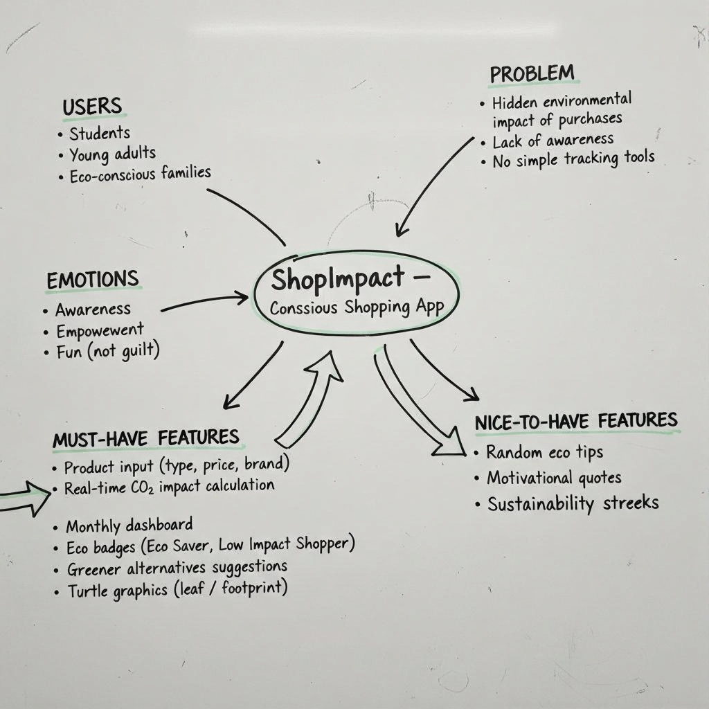
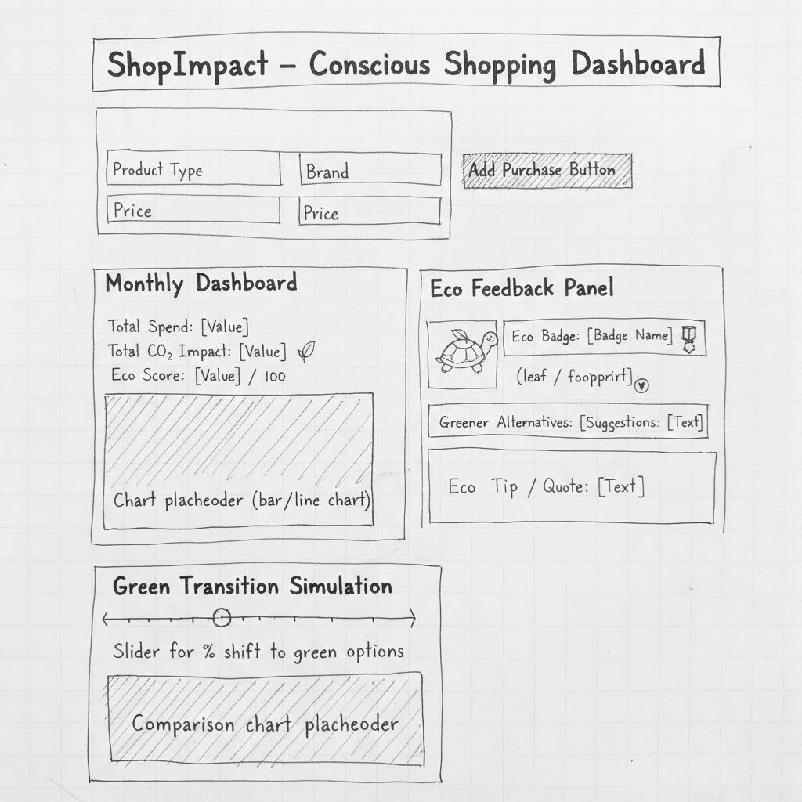
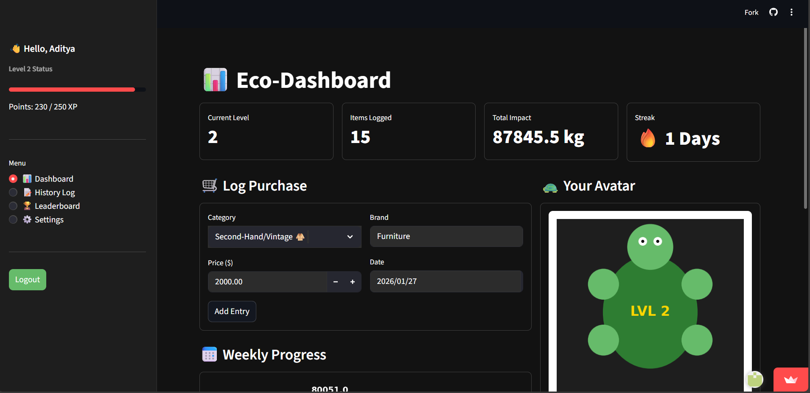
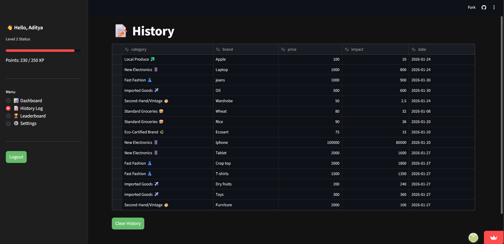
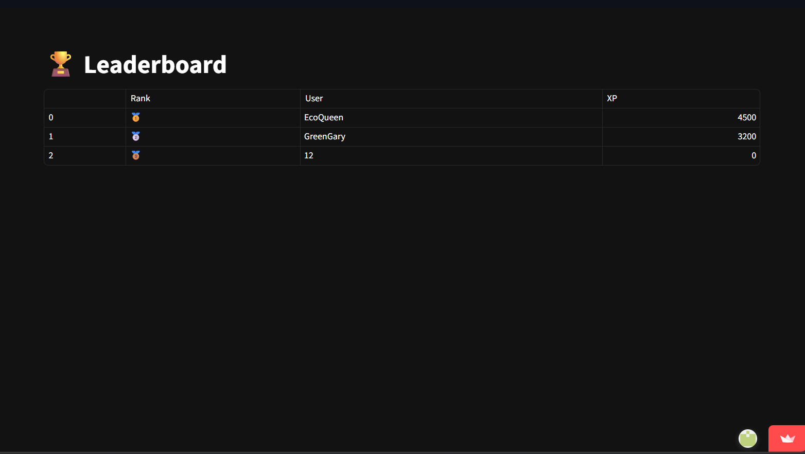
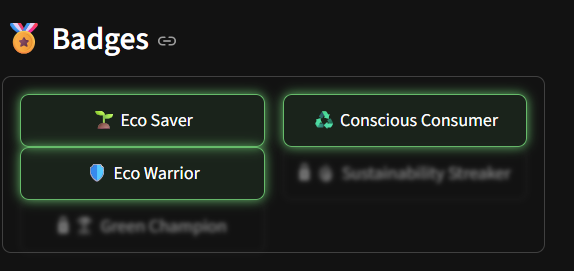
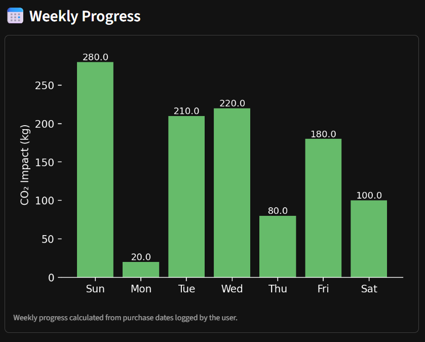
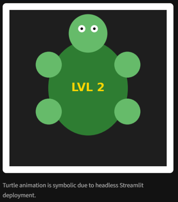
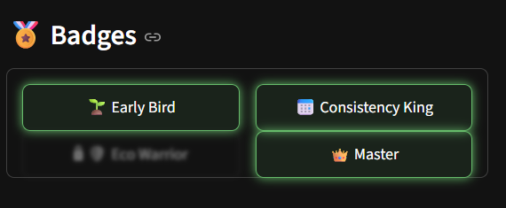

# 🌍 ShopImpact — Gamified Conscious Shopping Dashboard


**Student Name:** Aditya Jitendra Kumar Sahani  
**Student ID:** 1000414  
**Course:** Artificial Intelligence | Python Programming  
**Assessment Type:** Summative Assessment  
**Project Title:** Design and Deploy an Interactive Python Application  

---

## 📋 Project Overview

**ShopImpact** is an interactive web application built using **Python** and **Streamlit** that allows users to track and reflect on the environmental (CO₂) impact of their shopping habits.

The project converts abstract sustainability data into a **clear, visual, and gamified dashboard**, helping users understand how everyday purchase choices contribute to environmental impact. The application focuses on **education, awareness, and engagement**, rather than fear-based messaging.

This project demonstrates the complete lifecycle of an interactive Python application — from planning and logic design to testing and cloud deployment.

---

## ❗ Problem Statement

Many people are unaware of the environmental impact of common consumer products. Sustainability information is often complex, numerical, or disconnected from everyday decision-making.

This project addresses that issue by:
- Simplifying CO₂ impact estimation
- Visualizing impact using charts and dashboards
- Encouraging reflection through gamification mechanics

---

## 🎯 Project Objectives

- Demonstrate **core Python programming skills** using lists, dictionaries, and functions  
- Design a **user-friendly and interactive Streamlit interface**  
- Apply **rule-based logic** for impact calculation, streaks, and badges  
- Use **gamification techniques** to encourage consistent interaction  
- Deploy a fully functional Python application using **Streamlit Cloud**

---

## ✨ Key Features

### 🛒 Core Functionality
- Product category, brand, price, and date input
- Real-time CO₂ impact calculation using category multipliers
- Purchase history stored using Python data structures
- Weekly impact visualization

### 🎮 Gamification & Engagement
- XP-based level system
- Consecutive-day shopping streak tracking
- Unlockable achievement badges
- Visual badge lock / blur effect for locked achievements

### 📊 Visual Dashboard
- Key metrics (Level, Items Logged, Total Impact, Streak)
- Weekly impact bar chart
- Turtle avatar that evolves with user level

---

## 🏆 Gamification System (Implemented Logic)
The gamification system in ShopImpact is intentionally designed to reward sustainable behavior rather than increased consumption. Badges and progress are unlocked based on low environmental impact, improvement over time, and mindful purchasing choices, ensuring ethical alignment with sustainability goals.

### 🎯 XP Rules
| Action | XP |
|------|----|
| Log a purchase | +10 XP |
| Choose a low-impact category | Bonus XP |

### 🏅 Badge Rules
| Badge | Condition |
|-----|----------|
| 🌱 Eco Saver| Maintain a low total CO₂ footprint |
| ♻️ Conscious Consumer | Majority of purchases are low-impact |
| 🛡️ Eco Warrior | Consistently low average impact |
| 🔥 Sustainability Streaker | Maintain multiple consecutive low-impact days |
| 🏆 Green Champion | Demonstrate reduction in impact over time |

> ***Design Note:** Badges are awarded for better choices, not more purchases, reinforcing responsible consumption rather than encouraging increased buying behavior.*

---

## 📈 Level System

| Level | XP Range |
|------|----------|
| Level 1 | 0–99 |
| Level 2 | 100–249 |
| Level 3 | 250–499 |
| Level 4 | 500+ |

The turtle avatar visually evolves as the user progresses through levels.

---

## 🎨 User Interface Design

- Dark forest color palette (greens, dark neutrals)
- Clear visual hierarchy
- Inputs at the top, dashboard in the center
- Badges and turtle avatar displayed on the side
- Locked badges appear **blurred with lock icon**

---

## 🔧 Technical Architecture

### Technologies Used
- **Python** — core application logic
- **Streamlit** — interactive web interface
- **Pandas** — data handling and export
- **Matplotlib** — charts and turtle avatar graphics
- **Datetime** — streak and weekly tracking

### Data Structures
- List of dictionaries for purchase storage
- Dictionaries for impact multipliers and XP thresholds
- Session state for user persistence

---

## 📁 Project Structure

```text
IDAI102-1000414-ADITYA-JITENDRA-KUMAR-SAHANI-SA/
│
├── app.py                  # Main Streamlit application
├── requirements.txt        # Python dependencies
├── README.md               # Project documentation
│
├── interactive links       # Interactive Links (github & streamlit)
│   └── README.md           
├── assets/
│   ├── stage1/             # Planning & design (wireframes, mindmaps)
│   │   ├── mindmap.png
│   │   └── wireframe.png
│   │
│   ├── stage3/             # Interface development (UI iterations)
│   │   ├── interface_1.png
│   │   ├── interface_2.png
│   │   └── interface_3.png
│   │
│   ├── stage4/             # Testing & gamification evidence
│   │   ├── testing_1.png
│   │   ├── badges.png
│   │   └── weekly_chart.png
│   │
│   └── screenshots/        # Final deployed application UI
│       ├── ui_dashboard.png
│       ├── ui_purchase.png
│       ├── ui_gamification.png
│       ├── ui_badges.png
│       ├── ui_weekly.png
│       └── ui_turtle.png
```

# 📁 Project Development Stages

### 🧠 Stage 1: Planning & Design
The planning stage focused on identifying users and pain points. Feature planning was completed using a whiteboard-style mind map followed by low-fidelity wireframes to establish layout and user flow.

  
*Figure 1: Project Mindmap*

  
*Figure 2: Low-fidelity UI Wireframe*

### 🧮 Stage 2: Build the Python Logic
Used a list of dictionaries to store purchases
Applied category-based CO₂ multipliers
Designed modular functions for impact calculation, scoring, and badges

### 🖥️ Stage 3: Interactive Interface
The interface was refined iteratively based on usability testing and visual clarity.
Screenshots below show the finalized interface used for deployment.

#### 📸 Interface Screenshots (Final UI)

| Dashboard Overview | Purchase Logging |
|-------------------|------------------|
|  |  |

| Gamification Panel | Badge System |
|-------------------|--------------|
|  |  |

| Weekly Analytics | Turtle Avatar |
|-----------------|---------------|
|  |  |

**Note:** The Eco Feedback Panel persistently displays greener alternatives and eco tips based on the user’s most recent purchase, ensuring alignment between the planned wireframe and final interface.

*Figure 3: Final ShopImpact interface showing dashboard metrics, purchase logging, gamification elements, badge system, weekly analytics, and the symbolic turtle avatar.*

### 🧪 Stage 4: Testing & Gamification

Testing was conducted using 15 unique purchase scenarios to validate badge unlocking rules, point accumulation accuracy, and overall dashboard calculations.

  

During testing, the badge logic was refined to ensure rewards were based on environmental efficiency and improvement rather than purchase quantity, aligning the gamification system with sustainability principles.

 
In addition to functional testing, informal usability testing was carried out with peers to assess clarity of navigation, readability of metrics, and overall user experience. Based on this feedback, badge visuals were simplified for better recognition, and a weekly impact chart was introduced to improve trend visibility and user understanding.

### 🚀 Stage 5: Deployment
The finalized application was deployed on **Streamlit Cloud**, ensuring accessibility for users across different devices. Dependencies were managed via `requirements.txt` to guarantee a consistent runtime environment.

---

## 🚀Installation & Deployment

### Prerequisites
- Python 3.8 or higher
- pip package manager
- Internet connection

### Local Execution

Clone the repository:

```bash
git clone https://github.com/adityasahani392217/IDAI102-1000414-ADITYA-JITENDRA-KUMAR-SAHANI-SA.git
cd IDAI102-1000414-ADITYA-JITENDRA-KUMAR-SAHANI-SA
```

#### Install required dependencies:

```bash
pip install -r requirements.txt
```

#### Run the application:

```bash
streamlit run app.py
```

### Streamlit Cloud Deployment:
1. Push your project to GitHub 
2. Go to Streamlit Cloud (streamlit.io/cloud)
3. Sign in with your GitHub account
4. Click "New app" and select your repository
5. Set the main file path to `app.py`
6. Click "Deploy" - Streamlit Cloud will handle the rest

## 🌐 Live Web App Link
The deployed application is accessible at: 
[Streamlit Live Web App Access Link ](https://idai102-1000414-aditya-jitendra-kumar-sahani-shopimpact.streamlit.app/)

### 🌱 Ethical & Social Considerations
* $CO_{2}$ values are simplified estimates for educational purposes.
* The application avoids fear-based or guilt-driven messaging to maintain positive engagement.
* Demonstrates ethical use of technology for environmental and social good.

### 📌 Conclusion
ShopImpact demonstrates the complete lifecycle of a Python-based interactive application—from problem identification to deployment. It highlights how technology can support sustainability awareness and responsible consumer behavior.

### 📚 References

1. [Streamlit Documentation](https://docs.streamlit.io/)
2. [Python Software Foundation](https://docs.python.org/3/)


**Track • Reflect • Improve • Shop Responsibly 🌍**
